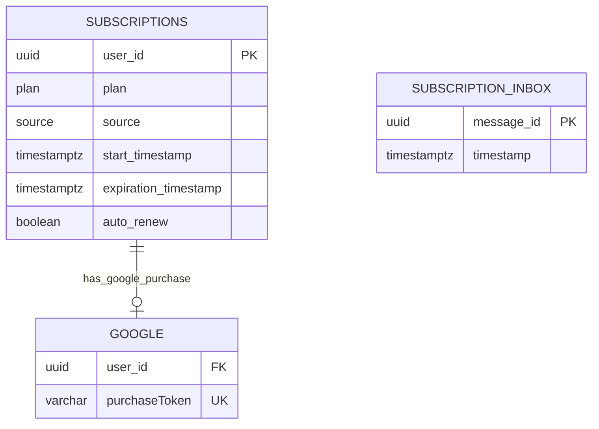

# ChefBook Backend Subscription Service

The subscription service owns subscription state, subscription source tracking, Google Play subscription confirmation, renewal/cancellation events, and subscription-related MQ processing.

## Responsibilities

- Return profile subscriptions and current subscription.
- Confirm Google subscription purchases.
- Acknowledge Google subscription purchases after successful claim.
- Process Google real-time developer notifications.
- Track subscription source, expiration, and auto-renew state.
- Import legacy premium state from Firebase profile import messages.
- Delete profile subscription state when profile deletion messages arrive.

## Main RPC Families

- `GetProfileSubscriptions`
- `GetProfileCurrentSubscription`
- `ConfirmGoogleSubscription`

## Dependencies

- Calls `auth` for user email when sending subscription-related mail.
- Uses Google Android Publisher API for purchase validation and acknowledgement.
- Uses Google Pub/Sub for Google real-time developer notifications.
- Consumes profile lifecycle messages from MQ when configured.
- Owns its PostgreSQL schema and migrations.

## Database Ownership

Owns:

- `subscriptions` - user plan, source, start, expiration, and auto-renew state.
- `google` - Google purchase token binding.
- `inbox` - idempotent MQ message processing.

Important constraints:

- Subscriptions are unique by user, plan, and source.
- `google.purchaseToken` is globally unique.
- `user_id` is a logical cross-service reference.
